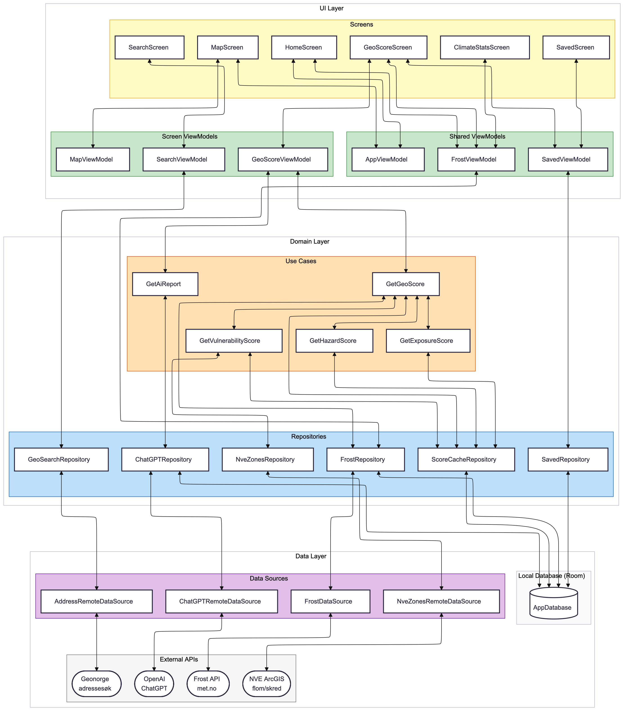

# ARCHITECTURE.md
---

## Introduksjon

Dette dokumentet er tiltenkt utviklere som skal sette seg inn i, videreutvikle og vedlikeholde GeoScore-appen. Det gir en oversikt over arkitekturvalgene som er gjort og hvordan disse er implementert i kodebasen
## Arkitekturskisse
Dette diagrammet viser den overordnede arkitekturen til Geomerking:




---

## Overordnet arkitektur

Appen følger Androids anbefalte lagdelte arkitektur (UI → Domain → Data) og er strukturert etter MVVM-mønsteret. Kodebasen er delt inn i fire hoveddeler:

```
app/
├── data/           — Datakilde, Room-database, DTOer og repository-implementasjoner
├── domain/         — Domenemodeller, repository-grensesnitt og use cases
├── ui/             — Skjermer, ViewModels, navigasjon og gjenbrukbare komponenter
└── di/             — Hilt-moduler for dependency injection
```

**`/data`** håndterer all datahenting og lokal lagring: datasources kommuniserer direkte med eksterne 
API-er, repositories implementerer grensesnitt fra domenelaget og håndterer mapping fra DTOer til 
domenemodeller, og `local/` inneholder Room-database med DAOs og entities.

**`/domain`** er ren forretningslogikk uten Android-spesifikke avhengigheter: domenemodeller i `model/`,
repository-grensesnitt i `repository/`, og use cases i `usecase/` med ett ansvarsområde hver.

**`/ui`** inneholder alt knyttet til brukergrensesnittet: en pakke per skjerm med Screen-composable 
og ViewModel, delte ViewModels i `sharedViewModels/`, og navigasjonsgraph i `navigation/`

### `/di` - Dependency Injection
Inneholder 4 Hilt-moduler:

| Modul | Innhold | Scope |
|---|---|---|
| `NetworkModule.kt` | Tre navngitte Ktor `HttpClient`-instanser + OpenAI-klient | `@Singleton` |
| `DatabaseModule.kt` | Room `AppDatabase` + alle 11 DAOs | `@Singleton` |
| `DataSourceModule.kt` | `@Binds` for datasource-grensesnitt | `@Singleton` |
| `RepositoryModule.kt` | `@Binds` for repository-grensesnitt | `@Singleton` |
 
---

## Dependency Injection med Hilt

Appen bruker **Hilt 2.59.2** for dependency injection. `GeoScoreApp` er annotert med 
`@HiltAndroidApp`, `MainActivity` med `@AndroidEntryPoint`, og alle ViewModels med `@HiltViewModel`.
Alle repositories, datasources og use cases bruker constructor injection med `@Inject constructor`. 
`@Singleton` brukes på nettverksklienter, DAOs og repositories. ViewModels som deles på tvers av 
skjermer er eksplisitt passert ned via `NavigationRoot`.


## Objektorienterte prinsipper

### MVVM (Model-View-ViewModel)
Appen følger MVVM-mønsteret som anbefalt av Android:
- **View** (Jetpack Compose-skjermer) viser data og sender brukerhandlinger videre
- **ViewModel** holder UI-state som `StateFlow<UiState>` og kommuniserer med domenelaget
- **Model** (use cases + repositories) henter og behandler data

### Lav kobling
- Alle repositories og datasources er definert som grensesnitt i domenelaget
- ViewModels og use cases kjenner kun til grensesnittet, ikke implementasjonen
- Use cases injiserer `ScoreCacheRepository`-grensesnittet. De har ingen kjennskap til Room DAOs eller Entity-klasser
- Hilt håndterer alle avhengigheter via constructor injection, noe som eliminerer direkte koblinger

### Høy kohesjon
- Hver use case har ett ansvarsområde (`GetHazardScore`, `GetExposureScore`, osv.)
- `ScoreCacheRepository` eier all score-relatert cache-logikk og holder dette borte fra use cases
- `ChatGPTRepositoryImpl` eier rapport-caching-logikken
- Skjermer er organisert i egne pakker med tilhørende ViewModel og UiState

### Unidirectional Data Flow (UDF)
Data flyter konsekvent i én retning:
1. UI utløser hendelser (brukerklikk, navigasjon, input)
2. ViewModel mottar hendelser og oppdaterer `StateFlow<UiState>`
3. UI observerer `StateFlow` med `collectAsStateWithLifecycle()` og re-rendrer ved tilstandsendringer

---

## Teknologier og versioner

| Teknologi | Versjon | Bruk |
|---|---|---|
| **Kotlin** | 2.3.21 | Kodespråk |
| **Jetpack Compose** | 2026.05.00 | UI-rammeverk |
| **Navigation 3** | 1.1.1 | Type-safe navigasjon mellom skjermer |
| **Hilt** | 2.59.2 | Dependency injection |
| **KSP** | 2.3.8 | Kotlin Symbol Processing for Hilt og Room |
| **Room** | 2.8.4 | Lokal SQLite-database for caching |
| **Ktor** | 3.4.3 | HTTP-klient for API-kall |
| **kotlinx.serialization** | 1.11.0 | JSON-serialisering |
| **OpenAI client** | 4.1.0 | ChatGPT-integrasjon for AI-rapporter |
| **Google Maps Compose** | 8.3.0 | Interaktivt kartvisning |
| **Kotlin Coroutines** | 1.11.0 | Asynkrone operasjoner |
| **JUnit** | 4.13.2 | Unit testing |

---

## Eksternale API-integrasjoner

Appen integrerer fem eksterne API-tjenester:

| API | Base URL | Autentisering | Datasource |
|---|---|---|---|
| **Frost v0** (met.no) | `https://frost.met.no/` | `FROST_CLIENT_ID` + `FROST_CLIENT_SECRET` (fra BuildConfig) | `FrostDataSource` |
| **Frost v1 RC** (met.no) | `https://frost-rc.met.no/api/v1/obs/ranked/get` | Samme som Frost v0 | `FrostDataSource` |
| **NVE ArcGIS** (flom- og skredsoner) | `https://kart.nve.no/enterprise/rest/services` | Ingen | `NveZonesRemoteDataSource` |
| **Geonorge adressesøk** | `https://ws.geonorge.no/adresser/v1/` | Ingen | `AddressRemoteDataSource` |
| **OpenAI (ChatGPT)** | Via `openai-client`-bibliotek | `CHATGPT_API_KEY` fra `BuildConfig` | `ChatGPTRemoteDataSource` |

Alle HTTP-klienter bruker **Ktor CIO-engine** med `ContentNegotiation` og `kotlinx.serialization` for JSON-håndtering.

---

## Lokal lagring og caching

Appen bruker **Room** for lokal caching av aggregert data og beregnede resultater. Databasen `team20_app_db` inneholder 11 tabeller:

| Tabell | Innhold                           | Eier |
|---|-----------------------------------|---|
| `saved_locations` | Lagrede lokasjoner                | `SavedRepository` |
| `hazard_cache` | Farepoengsum per lokasjon         | `ScoreCacheRepository` |
| `exposure_cache` | Eksponeringspoengsum per lokasjon | `ScoreCacheRepository` |
| `vulnerability_cache` | Sårbarhetsscore per lokasjon      | `ScoreCacheRepository` |
| `total_score_cache` | Samlet GeoScore per lokasjon      | `ScoreCacheRepository` |
| `report_cache` | AI-generert rapport per lokasjon  | `ChatGPTRepository` |
| `temperature_cache` | Temperaturdata (Frost)            | `FrostRepository` |
| `wind_cache` | Vinddata (Frost)                  | `FrostRepository` |
| `sunshine_cache` | Solskinndata (Frost)              | `FrostRepository` |
| `snow_cache` | Cachet snødybdedata (Frost)       | `FrostRepository` |
| `precipitation_cache` | Nedbørsdata (Frost)               | `FrostRepository` |


### Frost API-caching strategi

`FrostRepository` bruker en to-lags caching-strategi for å minimere API-kall:

**Lag 1: Stasjonsliste (in-memory).** Koordinater rundes til 2 desimaler (~1km presisjon) og brukes som nøkkel for å slå opp de 10 nærmeste værstasjoner. 
Listen caches i minnet slik at påfølgende kall for samme område gjenbruker den uten nye API-kall. 10 stasjoner gir robuste normaler som er mindre følsomme for datagap ved enkeltstasjoner.

**Lag 2: Klimadata (Room, indeksert ved stationId).** Nærmeste stasjon brukes som primærnøkkel i Room-cachene. 
Dermed kan to lokasjoner med samme nærmeste stasjon dele cachet data. Lokasjon (59.33, 11.29) og (59.34, 11.30) vil begge treffe SN1380, og data cachet fra den første gjenbrukes for den andre.

**Solskinn (spesialtilfelle).** Kun 36 stasjoner i Norge har solskinndata, så nærmeste solskinnstasjon slås opp separat og caches i minnet per lokasjon. Klimadataene caches deretter i Room på vanlig måte.

---

## Android API-nivå

| Innstilling | Verdi | Begrunnelse |
|---|---|---|
| `minSdk` | 24 (Android 7.0 Nougat) | Støtter ~95% av aktive enheter; balanse mellom kompatibilitet og moderne funksjoner |
| `targetSdk` | 36 | Sikrer kompatibilitet med nyeste Android-funksjoner og sikkerhetskrav |
| `compileSdk` | 36 | Samme som targetSdk |

**Notat:** AGP 9.0.0 krever Hilt 2.59+ da tidligere versjoner er inkompatible. Hilt 2.57.1 bruker `BaseExtension` fra Android Gradle Plugin som ble fjernet i AGP 9.

---
## Pakkestruktur

```
app/src/main/java/no/uio/ifi/in2000/team20/team20app/
├── GeoScoreApp.kt              — @HiltAndroidApp entry point
├── MainActivity.kt             — @AndroidEntryPoint
│
├── data/
│   ├── api/                    — API-klasser (Ktor endpoints)
│   ├── datasource/             — Externe datakildeklasser
│   ├── dto/                    — Deserialiserte API-responsmodeller
│   ├── local/
│   │   ├── AppDatabase.kt
│   │   ├── dao/               — 11 Room DAOs
│   │   └── entity/            — 11 Room entities
│   └── repository/            — 6 repository-implementasjoner
│
├── domain/
│   ├── model/                 — Domenemodeller (GeoScore, Location, osv.)
│   └── usecase/               — 5 use cases (GetGeoScore, GetHazardScore, osv.)
│
├── ui/
│   ├── screens/               — 5 skjermpakker (home, map, result, saved, search)
│   ├── sharedViewModels/      — AppViewModel, FrostViewModel, SavedViewModel
│   ├── navigation/            — NavigationRoot.kt, Route.kt
│   ├── components/            — Gjenbrukbare UI-komponenter
│   └── theme/                 — Farger, typer, temaer
│
├── di/                        — 4 Hilt-moduler
└── util/                      — Constants, formatters, helpers
```
---

## Mulige fokusområder ved vidreutvikling / vedlikehold 

### 1. Use case-navngivning 

Use cases heter `GetGeoScore`, `GetHazardScore` osv. altså uten `UseCase`-suffiks. Anbefales refaktorert.

### 2. Repository-navngivning

Frost, NVE og GeoSearch sine grensesnitt heter `FrostRepositoryService`, `NveZonesRepositoryService`,
`GeoSearchRepositoryService` istedenfor `FrostRepository` osv. Anbefales refaktorert.

### 4. Delte ViewModels på tvers av skjermer

`FrostViewModel`, `SavedViewModel` og `AppViewModel` deles på tvers av skjermer. Dette er en 
pragmatisk løsning: `FrostViewModel` deles fordi `HomeScreen` forhåndslaster data for etterfølgende 
skjermer, `SavedViewModel` fordi `isCurrentSaved`-flagget må være konsistent globalt, og `AppViewModel` 
fordi valgt lokasjon må deles mellom alle skjermer. Ved vidreutvikling av appen kan dette vurderes endret.

### 5. Frost-caching og manglende fallback-logikk

`FrostRepository` aggregerer klimanormaler fra de 10 nærmeste værstasjoner, men cacher resultatet med
kun den nærmeste stasjonens ID som nøkkel. Dette betyr at den cachede dataen teknisk sett representerer 
et gjennomsnitt av 10 stasjoner, ikke én enkelt. Dette kan skape forvirring under debugging.

I tillegg finnes ingen fallback-logikk, med unntak av for solskinn. Hvis de 10 nærmeste stasjonene mangler data for en klimaparameter 
i hele 1991-2020-perioden, vises feilmelding istedenfor å forsøke alternative kilder. 
Begge deler er aksepterte avveininger gitt prosjektets tidsrammer, men anbefales adressert ved videreutvikling.
