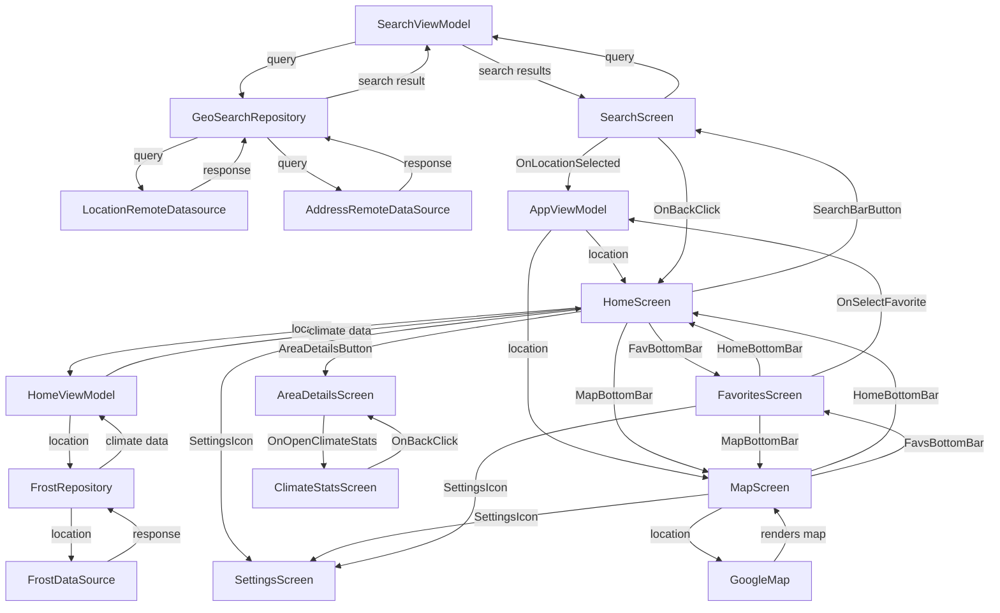

```mermaid
flowchart TD

    SearchViewModel[SearchViewModel]
    GeoSearchRepository[GeoSearchRepository]
    LocationRemoteDatasource[LocationRemoteDatasource]
    AddressRemoteDataSource[AddressRemoteDataSource]

    HomeViewModel[HomeViewModel]
    FrostRepository[FrostRepository]
    FrostDataSource[FrostDataSource]

    AppViewModel[AppViewModel]
    GoogleMap[GoogleMap]

    Home[HomeScreen]
    Search[SearchScreen]
    Settings[SettingsScreen]
    Favs[FavoritesScreen]
    Map[MapScreen]
    AreaDetails[AreaDetailsScreen]
    ClimateStats[ClimateStatsScreen]


    Search -- query --> SearchViewModel
    SearchViewModel -- query --> GeoSearchRepository
    GeoSearchRepository -- query --> LocationRemoteDatasource
    GeoSearchRepository -- query --> AddressRemoteDataSource
    LocationRemoteDatasource -- response --> GeoSearchRepository
    AddressRemoteDataSource -- response --> GeoSearchRepository
    GeoSearchRepository -- search result --> SearchViewModel
    SearchViewModel -- search results --> Search

    AppViewModel -- location --> Home
    Home -- location --> HomeViewModel
    HomeViewModel -- location --> FrostRepository
    FrostRepository -- location --> FrostDataSource
    FrostDataSource -- response --> FrostRepository
    FrostRepository -- climate data --> HomeViewModel
    HomeViewModel -- climate data --> Home

    AppViewModel -- location --> Map
    Map -- location --> GoogleMap
    GoogleMap -- renders map --> Map

    Home -- SearchBarButton --> Search
    Home -- FavBottomBar --> Favs
    Home -- SettingsIcon --> Settings
    Home -- MapBottomBar --> Map
    Home -- AreaDetailsButton --> AreaDetails

    Map -- SettingsIcon --> Settings
    Favs -- SettingsIcon --> Settings

    Search -- OnLocationSelected --> AppViewModel
    Search -- OnBackClick --> Home

    AreaDetails -- OnOpenClimateStats --> ClimateStats
    ClimateStats -- OnBackClick --> AreaDetails

    Map -- HomeBottomBar --> Home
    Map -- FavsBottomBar --> Favs

    Favs -- MapBottomBar --> Map
    Favs -- HomeBottomBar --> Home
    Favs -- OnSelectFavorite --> AppViewModel
```