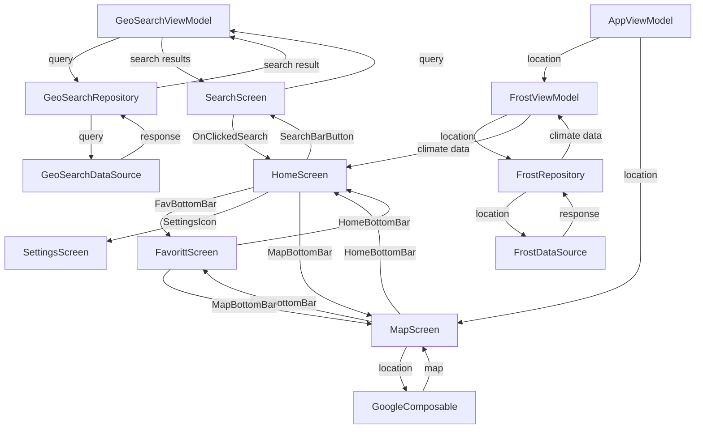

```mermaid
flowchart TD

    GeoSearchViewModel[GeoSearchViewModel]
    GeoSearchRepository[GeoSearchRepository]
    GeoSearchDataSource[GeoSearchDataSource]

    FrostViewModel[FrostViewModel]
    FrostRepository[FrostRepository]
    FrostDataSource[FrostDataSource]


    AppViewModel[AppViewModel]
    GoogleComposable[GoogleComposable]

    Home[HomeScreen]
    Search[SearchScreen]
    Settings[SettingsScreen]
    Favs[FavorittScreen]
    Map[MapScreen]
    

    Search -- query --> GeoSearchViewModel
    GeoSearchViewModel -- query --> GeoSearchRepository
    GeoSearchRepository -- query --> GeoSearchDataSource
    GeoSearchDataSource -- response --> GeoSearchRepository
    GeoSearchRepository -- search result --> GeoSearchViewModel
    GeoSearchViewModel -- search results --> Search

    AppViewModel -- location --> FrostViewModel
    FrostViewModel -- location --> FrostRepository
    FrostRepository -- location --> FrostDataSource
    FrostDataSource -- response --> FrostRepository
    FrostRepository -- climate data --> FrostViewModel
    FrostViewModel -- climate data --> Home

    AppViewModel -- location --> Map
    Map -- location --> GoogleComposable
    GoogleComposable -- map --> Map

    Home -- SearchBarButton --> Search
    Home -- FavBottomBar --> Favs
    Home -- SettingsIcon --> Settings
    Home -- MapBottomBar --> Map

    Search -- OnClickedSearch --> Home

    Map -- HomeBottomBar --> Home
    Map -- FavsBottomBar --> Favs

    Favs -- MapBottomBar --> Map
    Favs -- HomeBottomBar --> Home
```