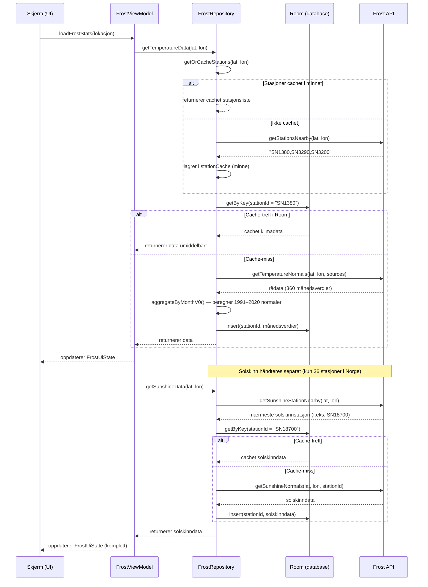

# MODELING.md 

### Sekvensdiagram
Her er et sekvensdiagram som modellerer dataflyten til Frost API, med caching, alternativ flyt og spesialbehandlingen av solskinnsdata.
Dette viser hele dataflyten fra UI ned til API og tilbake, inkludert:

- **Stasjonscaching** i minnet (unngår gjentatte API-kall)
- **Room cache-first** logikken (treff vs miss)
- **Solskinn som spesialtilfelle** med `Note` for å forklare hvorfor
- **Alt-blokker** for alternativ flyt (cachet vs ikke cachet)

