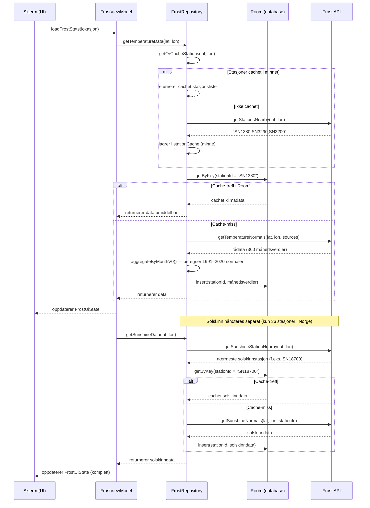

# MODELING.md 

### Sekvensdiagram
Her er et sekvensdiagram som modellerer dataflyten til Frost API, med caching, alternativ flyt og spesialbehandlingen av solskinnsdata.
Dette viser hele dataflyten fra UI ned til API og tilbake, inkludert:

- **Stasjonscaching** i minnet (unngår gjentatte API-kall)
- **Room cache-first** logikken (treff vs miss)
- **Solskinn som spesialtilfelle** med `Note` for å forklare hvorfor
- **Alt-blokker** for alternativ flyt (cachet vs ikke cachet)

## Use Case 2: Beregne og utforske GeoScore for en valgt lokasjon

## Mål
Brukeren skal kunne velge en lokasjon og beregne GeoScoren for den

## Aktører
Primær aktør: Bruker
Sekundær aktører: Geonorge adresse-API, Frost API (V1), Google maps composable og ArcGis NveZones API

## Betingelser
Prebetingelser:
- Brukeren er tilkoblet internett
- Brukeren har åpnet appen

Postbetingelser:
- GeoScoren er beregnet og vises på skjermen
- Scoren er cachet lokalt i Room DB for fremtidig bruk

## Hovedflyt
1. Brukeren åpner appen og ser hjemskjermen med et søkefelt
2. Brukeren trykker på søkefeltet og skriver inn ønsket adresse
3. Appen sender et API-kall til Geonorge sitt adresse-API
4. Geonorge returnerer en liste med adresseforslag
5. Brukeren velger en adresse fra listen
6. Appen viser den valgte adressen som en pin på kartet
7. Brukeren trykker på "Generer rapport" for den valgte lokasjonen
8. Appen navigerer brukeren til et loading screen
9. Appen sender API-kall til Frost V1 og ArcGis NveZones og henter nedbør,vind, flom og skred data for lokasjonen
10. Frost returnerer Nedbør og vind data for de siste 30 årene
11. ArcGis returnerer om stedet er i en flom sone eller en skred sone
12. Appen aggregerer Vind og nedbørs data og calculerer GeoScore samt Nedbørs-, Vind-, Skred- og Flom-Score
13. Appen setter disse alle scorene utenom GeoScore inn i en prompt som blir sendt til Chat GPT API
14. Chat GPT API-et returnerer en tekstilg beskrivelse med tiltak for de forskjellige scorene
15. Appen cacher scorene og beskrivelsene i Room DB
16. Appen viser scorene og beskrivelsene på skjermen
17. brukeren navigerer seg gjennom Raport skjermen og utforsker GeoScoren

## Alternativ flyt

### A1: GeoScoren er allerede cachet (alternativ til steg 8–10)
A2.1 Appen oppdager at data for denne lokasjonen allerede finnes i Room DB
A2.2 Appen henter cachet data lokalt uten å gjøre API-kall
A2.3 Fortsetter fra steg 16 i hovedflyten

## Unntak
U1: Ingen internettforbindelse
- Appen varsler brukeren om manglende tilkobling
- Dersom lokasjonen er cachet tidligere, tilbys brukeren å se cachet data

U2: Frost API returnerer tomt svar
- Appen varsler brukeren om at det ikke finnes tilstrekkelig data for å beregne scoren