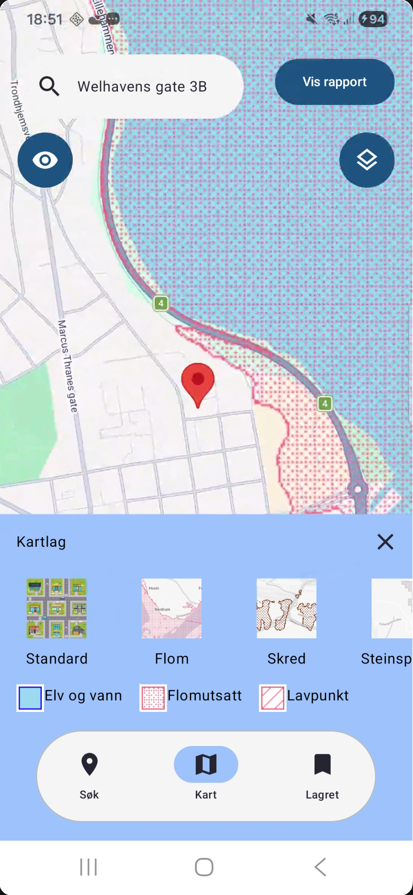

# GeoScore / Geomerking

GeoScore er en Android-applikasjon utviklet i IN2000 ved Universitetet i Oslo. Appen gir brukeren en samlet vurdering av naturfare og klimarelaterte forhold for en valgt adresse eller lokasjon.

Applikasjonen kombinerer kart, historiske værdata, flom- og skredinformasjon, lokale beregninger og en AI-generert rapport for å gi brukeren en mer forståelig vurdering av risiko knyttet til blant annet vind, nedbør, flom og skred.

## Demo

Se en kort demo av hovedflyten i appen (trykk på bildet):

Videoen viser blant annet:
- søk etter adresse/lokasjon
- visning av valgt sted i kart
- beregning av GeoScore
- visning av rapport og klimadata
- bruk av lagrede steder

## Hvordan kjøre applikasjonen

Appen er ikke publisert i Google Play Store.

Den kan kjøres på to måter:

- ved å installere en tilsendt APK-fil
- ved å åpne prosjektet i Android Studio og kjøre appen fra kildekode

### Kjøring fra kildekode

1. Klon repositoryet.
2. Åpne prosjektet i Android Studio.
3. Sørg for at Android SDK 24 eller nyere er installert.
4. Bygg og kjør appen på emulator eller fysisk Android-enhet.

## API-nøkler

I den opprinnelige IN2000-innleveringen ble API-nøkler lagt direkte inn i prosjektet etter avklaring med gruppelærer, for å gjøre sensur og kjøring enklere.

For videreutvikling eller offentlig bruk bør API-nøkler ikke hardkodes. De bør heller legges i for eksempel:

- local.properties
- Gradle secrets-plugin
- miljøvariabler
- annen sikker konfigurasjon som ikke sjekkes inn i Git

## Avhengigheter

- Android SDK 24 eller høyere, tilsvarende Android 7.0+
- Internett-tilkobling

Appen krever ingen spesielle tillatelser utover tilgang til internett.

## Teknologier og biblioteker

- Kotlin – hovedspråk
- Jetpack Compose – brukergrensesnitt
- Material 3 – designkomponenter
- Navigation 3 – navigasjon mellom skjermer
- Hilt – dependency injection
- Room – lokal database og caching
- Kotlinx Coroutines – asynkron programmering
- Kotlinx Serialization – serialisering/deserialisering av data
- Coil – bildehåndtering
- Google Maps Compose – kartvisning
- Compose Charts – visualisering av historiske klimadata
- JUnit – testing
- OpenAI API – generering av tekstlig rapport og forklaringer

## Gradle-plugins

- Kotlin Serialization – gjør det mulig å bruke @Serializable
- Kotlin Parcelize – gjør det mulig å bruke @Parcelize
- KSP – Kotlin Symbol Processing, blant annet brukt av Room/Hilt
- Hilt Gradle Plugin – dependency injection-oppsett

## Kjent status og begrensninger

### IDE-varsler

Prosjektet kan gi enkelte IDE-varsler, blant annet:

- noen deprecated-metoder som følge av bibliotekoppgraderinger
- én verdi som blir tilordnet, men ikke lest direkte

Disse varslene påvirker ikke hovedflyten i appen slik prosjektet ble levert, men bør ryddes opp i ved videreutvikling.

### LogCat-varsler

Ved bruk av Google Maps kan LogCat vise flere interne advarsler og Flogger-meldinger. Etter testing ser disse ut til å komme fra Google Maps sin interne implementasjon og ikke fra appens egen logikk.

Det kan også forekomme enkelte frame skips, spesielt på kartskjermen, siden Google Maps er et relativt tungt UI-element.

### Ufullstendig funksjonalitet

- Knappen for å laste ned lagrede rapporter er ikke ferdig implementert.
- Enkelte deler av appen er laget som en prototype/MVP og bør videreutvikles før eventuell produksjonssetting.

## Team 20

- David Hovde
- Jurius Abdo
- Matilda Wold Dahl
- Philip Fleischer
- Veronica Corsepius Melen
- Victoria Reinseth-Tollefsen
